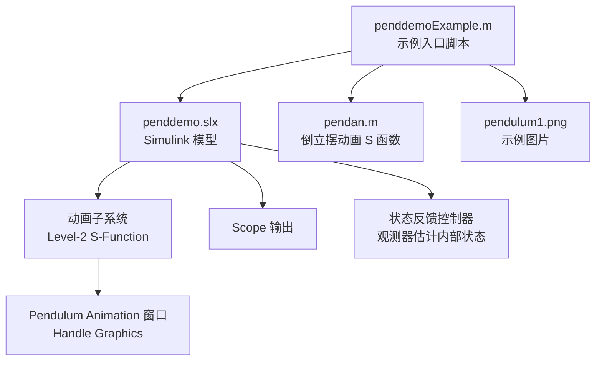
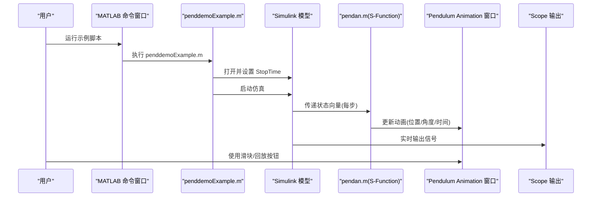
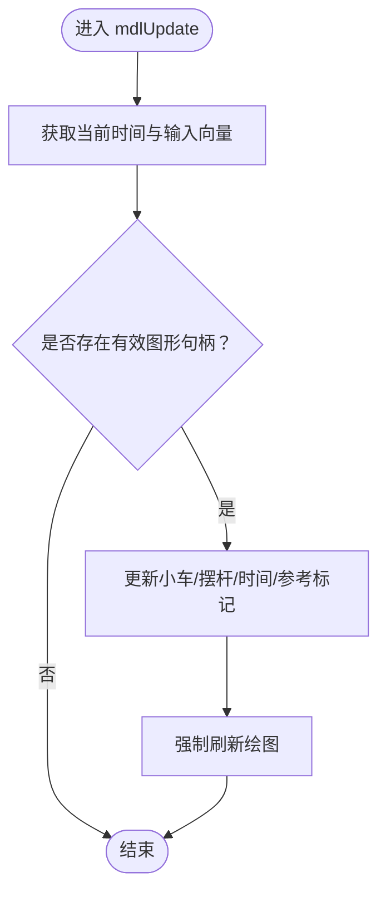
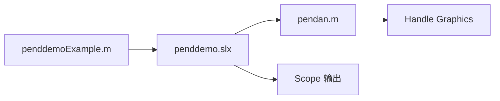
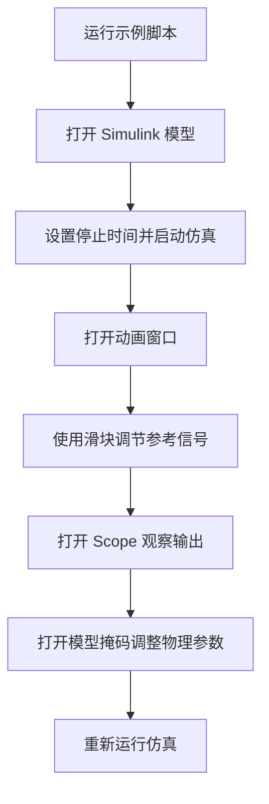
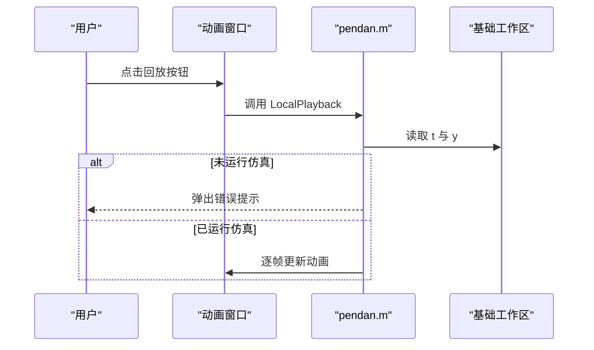

# 使用指南

<cite>
**本文引用的文件**
- [penddemoExample.m](file://penddemoExample/penddemoExample.m)
- [pendan.m](file://penddemoExample/pendan.m)
- [penddemo.slx](file://penddemoExample/penddemo.slx)
- [pendulum1.png](file://penddemoExample/pendulum1.png)
</cite>

## 目录
1. [简介](#简介)
2. [项目结构](#项目结构)
3. [核心组件](#核心组件)
4. [架构总览](#架构总览)
5. [详细组件分析](#详细组件分析)
6. [依赖关系分析](#依赖关系分析)
7. [性能与仿真设置](#性能与仿真设置)
8. [操作流程与参数调整](#操作流程与参数调整)
9. [回放与数据分析](#回放与数据分析)
10. [角色化操作建议](#角色化操作建议)
11. [故障排查](#故障排查)
12. [结论](#结论)

## 简介
本指南面向不同用户角色（学习者、研究人员、教师），帮助您从零开始运行倒立摆仿真系统。您将学会：
- 如何执行示例脚本并加载 Simulink 模型
- 启动仿真、观察动画效果与 Scope 输出
- 通过模型掩码调整物理参数并重新运行仿真
- 使用回放功能与数据检查器进行结果分析
- 针对不同角色的操作建议与常见问题排查

## 项目结构
该仓库包含一个最小可用示例：一个用于启动与控制仿真的 MATLAB 脚本、一个用于倒立摆动画的 S 函数，以及一个 Simulink 模型文件。下图展示了文件与模块之间的关系。

图表来源
- [penddemoExample.m](file://penddemoExample/penddemoExample.m#L1-L42)
- [pendan.m](file://penddemoExample/pendan.m#L1-L56)
- [penddemo.slx](file://penddemoExample/penddemo.slx)

章节来源
- [penddemoExample.m](file://penddemoExample/penddemoExample.m#L1-L42)

## 核心组件
- 示例入口脚本：负责打开模型、设置仿真时长、启动仿真，并引导用户打开动画窗口与 Scope。
- 动画 S 函数：在每次主要积分步更新时绘制倒立摆动画，支持播放回放、滑块调节参考信号等交互。
- Simulink 模型：包含倒立摆动力学、状态反馈控制、观测器估计、Scope 输出等子系统。
- 图片资源：示例说明中使用的静态图片。

章节来源
- [penddemoExample.m](file://penddemoExample/penddemoExample.m#L1-L42)
- [pendan.m](file://penddemoExample/pendan.m#L1-L56)

## 架构总览
下图展示了从脚本到模型、再到动画与输出的整体调用链路。

图表来源
- [penddemoExample.m](file://penddemoExample/penddemoExample.m#L1-L42)
- [pendan.m](file://penddemoExample/pendan.m#L58-L110)

## 详细组件分析

### 组件一：示例入口脚本（penddemoExample.m）
- 主要职责
  - 打开 Simulink 模型
  - 设置仿真停止时间
  - 启动仿真
  - 引导用户打开动画窗口与 Scope
  - 提示用户通过模型掩码修改物理参数
- 关键行为
  - 打开模型后设置停止时间为固定值
  - 启动仿真后，用户可在动画窗口中拖动滑块改变参考信号
  - 可打开“Pendulum”子系统查看模型掩码
  - 可打开“Scope”查看实时输出

章节来源
- [penddemoExample.m](file://penddemoExample/penddemoExample.m#L1-L42)

### 组件二：动画 S 函数（pendan.m）
- 组件类型：Level-2 S-Function
- 输入端口：1个，维度为3，直接馈通
- 更新频率：每0.1秒一次
- 主要功能
  - 初始化/更新动画窗口中的小车与摆杆图形对象
  - 显示当前时间与参考标记
  - 支持关闭窗口、删除块、滑块回调、回放动画
- 回放机制
  - 从基础工作区读取仿真记录的时间序列与状态
  - 若未先运行仿真则弹出错误提示
  - 在绘制过程中对异常进行容错处理

图表来源
- [pendan.m](file://penddemoExample/pendan.m#L58-L110)
- [pendan.m](file://penddemoExample/pendan.m#L211-L240)

章节来源
- [pendan.m](file://penddemoExample/pendan.m#L1-L56)
- [pendan.m](file://penddemoExample/pendan.m#L58-L110)
- [pendan.m](file://penddemoExample/pendan.m#L161-L209)
- [pendan.m](file://penddemoExample/pendan.m#L211-L240)
- [pendan.m](file://penddemoExample/pendan.m#L242-L279)
- [pendan.m](file://penddemoExample/pendan.m#L354-L395)

## 依赖关系分析
- 脚本依赖于 Simulink 模型与动画 S 函数
- 动画 S 函数依赖于 Handle Graphics 创建与更新图形对象
- 回放功能依赖于仿真结束后在基础工作区生成的时间序列数据

图表来源
- [penddemoExample.m](file://penddemoExample/penddemoExample.m#L1-L42)
- [pendan.m](file://penddemoExample/pendan.m#L1-L56)

章节来源
- [penddemoExample.m](file://penddemoExample/penddemoExample.m#L1-L42)
- [pendan.m](file://penddemoExample/pendan.m#L1-L56)

## 性能与仿真设置
- 动画更新周期：每0.1秒一次，适合实时观察但可能影响仿真速度
- 停止时间：示例脚本默认设置为固定值，可根据需要调整
- 仿真稳定性：倒立摆系统通常对初始条件与控制参数敏感，建议先观察默认参数再微调

章节来源
- [pendan.m](file://penddemoExample/pendan.m#L58-L110)
- [penddemoExample.m](file://penddemoExample/penddemoExample.m#L1-L42)

## 操作流程与参数调整

### 基础操作流程
- 步骤1：在 MATLAB 命令窗口运行示例脚本
- 步骤2：自动打开 Simulink 模型并启动仿真
- 步骤3：在动画窗口中使用滑块移动参考信号，观察系统响应
- 步骤4：打开 Scope 查看实时输出信号
- 步骤5：打开“Pendulum”子系统查看模型掩码，修改物理参数后重新运行仿真

图表来源
- [penddemoExample.m](file://penddemoExample/penddemoExample.m#L1-L42)

章节来源
- [penddemoExample.m](file://penddemoExample/penddemoExample.m#L1-L42)

### 参数调整步骤（通过模型掩码）
- 打开“Pendulum”子系统，进入模型掩码界面
- 修改物理参数（如质量、长度、重力加速度等）
- 保存设置并重新运行仿真，观察动画与 Scope 的变化

章节来源
- [penddemoExample.m](file://penddemoExample/penddemoExample.m#L27-L42)

## 回放与数据分析

### 回放功能
- 在动画窗口点击“回放”按钮，S 函数会从基础工作区读取仿真记录并逐帧播放
- 若未先运行仿真，将弹出错误提示
- 回放过程对异常进行容错处理，避免因图形对象被删除导致崩溃

图表来源
- [pendan.m](file://penddemoExample/pendan.m#L161-L209)

章节来源
- [pendan.m](file://penddemoExample/pendan.m#L161-L209)

### 数据检查器（Simulation Data Inspector）
- 示例脚本提示可使用 Simulation Data Inspector 分析已记录的信号
- 建议在仿真前启用信号记录，在仿真后打开数据检查器进行对比与导出

章节来源
- [penddemoExample.m](file://penddemoExample/penddemoExample.m#L37-L42)

## 角色化操作建议
- 学习者
  - 先运行默认参数，观察动画与 Scope 输出，理解系统动态
  - 微调质量、长度、重力等参数，观察对稳定性的影
  - 使用回放功能回顾仿真过程
- 研究人员
  - 在模型掩码中调整控制参数，比较不同策略下的响应
  - 结合 Simulation Data Inspector 对多组实验结果进行对比分析
  - 导出数据用于进一步处理或报告
- 教师
  - 使用示例脚本快速演示系统原理与控制思路
  - 引导学生通过滑块与掩码参数探索系统稳定性边界
  - 利用 Scope 与回放功能讲解关键信号与控制效果

## 故障排查
- 动画窗口未显示
  - 可能原因：未先运行仿真导致基础工作区缺少数据；或图形窗口被意外关闭
  - 解决方案：先运行仿真，再打开动画窗口；若窗口被关闭，重新运行脚本以重建窗口
- 仿真异常终止
  - 可能原因：参数设置不合理导致系统不稳定；积分步长过大；模型配置错误
  - 解决方案：减小积分步长或调整控制参数；恢复默认参数后重试；检查模型连接与信号范围
- 回放失败或报错
  - 可能原因：未先运行仿真；基础工作区变量缺失
  - 解决方案：先运行仿真，确保生成 t 与 y；若仍失败，重启仿真并重试回放
- Scope 无输出
  - 可能原因：未启用信号记录；模型中未连接到 Scope
  - 解决方案：确认模型中存在 Scope 并正确连接；在仿真前启用记录

章节来源
- [pendan.m](file://penddemoExample/pendan.m#L161-L209)
- [penddemoExample.m](file://penddemoExample/penddemoExample.m#L37-L42)

## 结论
本指南提供了从入门到进阶的完整操作路径，涵盖模型加载、仿真运行、动画观察、参数调整、回放与数据分析等关键环节。建议不同角色根据自身需求选择合适的操作重点，并结合故障排查建议快速定位与解决问题，从而高效完成倒立摆系统的仿真与教学任务。