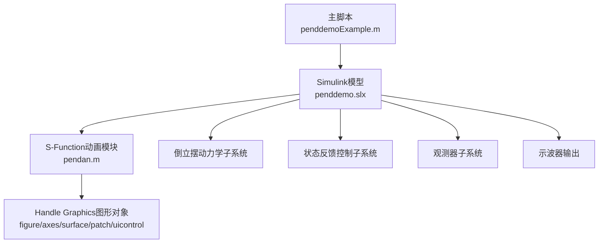
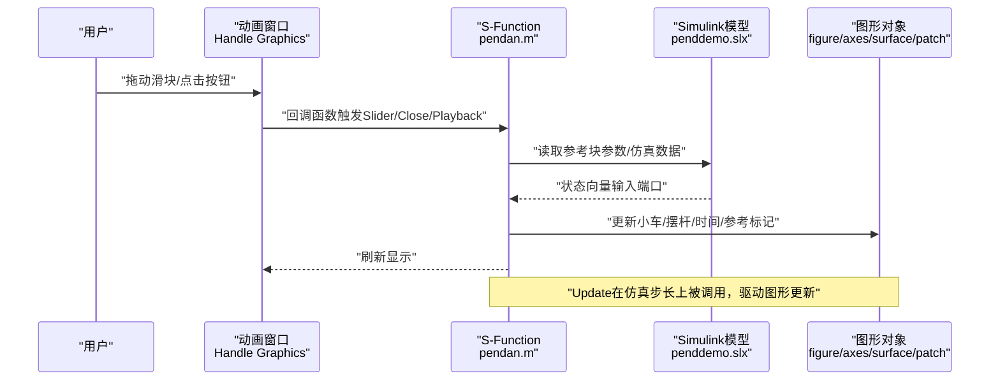
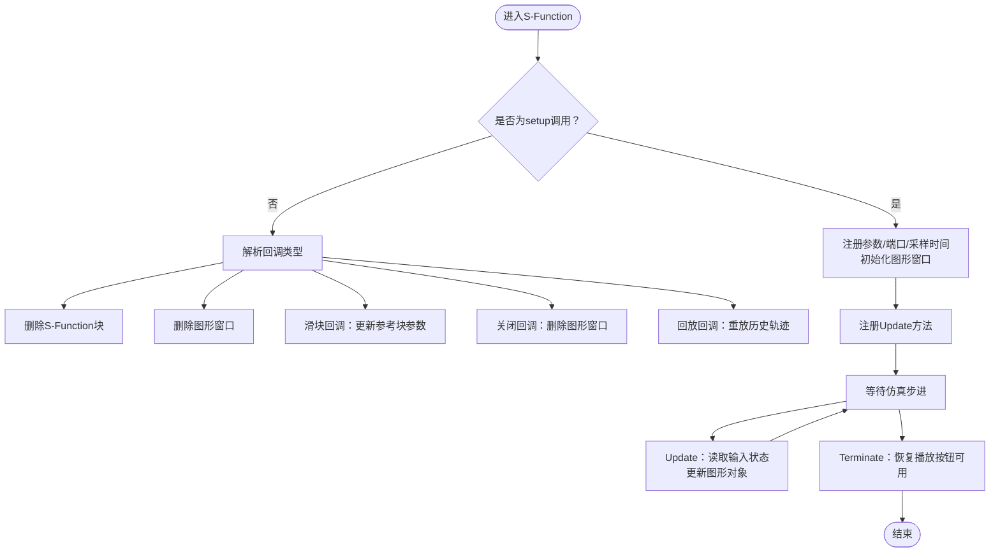
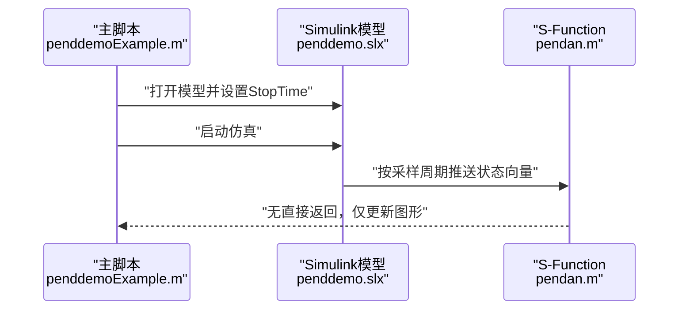
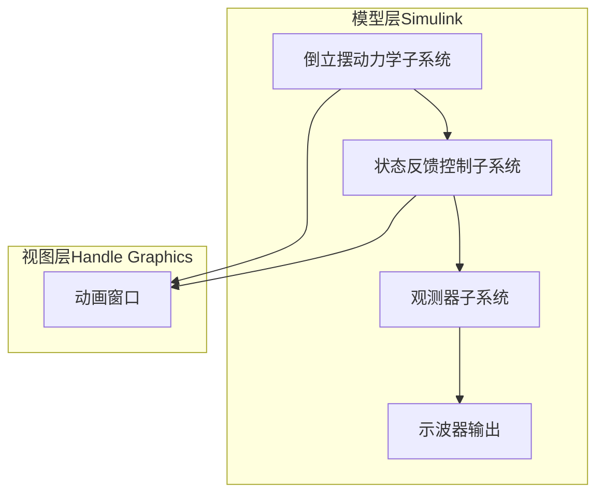
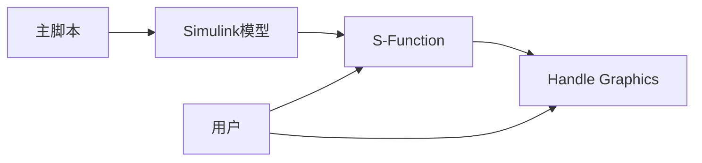

# 技术架构

<cite>
**本文引用的文件**
- [pendan.m](file://penddemoExample/pendan.m)
- [penddemoExample.m](file://penddemoExample/penddemoExample.m)
- [penddemo.slx](file://penddemoExample/penddemo.slx)
- [pendulum1.png](file://penddemoExample/pendulum1.png)
</cite>

## 目录
1. [引言](#引言)
2. [项目结构](#项目结构)
3. [核心组件](#核心组件)
4. [架构总览](#架构总览)
5. [详细组件分析](#详细组件分析)
6. [依赖分析](#依赖分析)
7. [性能考虑](#性能考虑)
8. [故障排查指南](#故障排查指南)
9. [结论](#结论)
10. [附录](#附录)

## 引言
本项目围绕“倒立摆系统”的Simulink仿真与动画演示展开，采用模块化设计与MVC（模型-视图-控制器）思想组织系统：  
- 模型层（Model）：由Simulink子系统与S-Function共同构成，负责倒立摆动力学与控制逻辑的建模与求解。  
- 视图层（View）：由MATLAB Handle Graphics图形对象组成，负责实时绘制小车与摆杆的位置变化，并提供时间显示、参考点标记、滑块与播放按钮等交互控件。  
- 控制器层（Controller）：由S-Function回调函数与Simulink模型参数联动构成，负责接收输入信号、更新动画状态、响应用户交互事件。  

同时，S-Function机制提供了可扩展的自定义功能接口，允许开发者以模块化方式接入新的可视化或控制策略；事件驱动架构体现在Handle Graphics控件回调与S-Function生命周期方法中，确保系统在仿真运行时与用户交互之间保持解耦与高效响应。

## 项目结构
项目位于 penddemoExample 目录下，包含以下关键文件：
- penddemoExample.m：主脚本，负责打开模型、设置仿真停止时间并启动仿真，同时提供注释引导用户查看模型不同模块。  
- pendan.m：Level-2 MATLAB S-Function，封装动画初始化、更新、终止与用户交互处理，作为视图与控制器的统一入口。  
- penddemo.slx：Simulink模型文件（二进制），包含倒立摆动力学、状态反馈控制、观测器与示波器等子系统。  
- pendulum1.png：示例图片资源，用于文档注释中的图像占位。

图表来源
- [penddemoExample.m](file://penddemoExample/penddemoExample.m#L1-L42)
- [pendan.m](file://penddemoExample/pendan.m#L1-L110)
- [penddemo.slx](file://penddemoExample/penddemo.slx#L1-L200)

章节来源
- [penddemoExample.m](file://penddemoExample/penddemoExample.m#L1-L42)
- [pendan.m](file://penddemoExample/pendan.m#L1-L110)
- [penddemo.slx](file://penddemoExample/penddemo.slx#L1-L200)

## 核心组件
- 主脚本（主程序入口）
  - 负责打开模型、设置仿真停止时间、启动仿真，并通过注释引导用户查看模型不同模块（倒立摆动力学、状态反馈控制、观测器与示波器）。  
  - 该脚本充当“系统编排者”，协调模型与动画的启动流程。  
- S-Function（动画控制器与视图管理）
  - 提供S-Function生命周期方法（注册、更新、终止）、用户交互回调（删除、关闭、滑块、播放、回放）与Handle Graphics图形初始化/更新逻辑。  
  - 通过输入端口接收仿真输出的状态向量，驱动图形对象更新位置与文本显示。  
- Simulink模型（系统模型）
  - 包含倒立摆非线性动力学、状态反馈控制、观测器估计与示波器输出等子系统，作为模型层的核心执行体。  
  - S-Function作为外部动画模块与模型进行数据交换与事件通信。

章节来源
- [penddemoExample.m](file://penddemoExample/penddemoExample.m#L1-L42)
- [pendan.m](file://penddemoExample/pendan.m#L1-L110)
- [penddemo.slx](file://penddemoExample/penddemo.slx#L1-L200)

## 架构总览
系统采用“模型-视图-控制器”分层架构：  
- 模型层：Simulink子系统与S-Function共同完成系统动力学与控制计算。  
- 视图层：S-Function内部创建并维护Handle Graphics图形对象，实时反映系统状态。  
- 控制器层：S-Function的回调函数与生命周期方法承担事件处理与状态同步职责。  

S-Function通过注册方法与回调函数实现事件驱动：  
- Update：在每个采样时刻根据输入状态更新图形对象。  
- Terminate：仿真结束时恢复播放按钮可用性。  
- 用户交互：滑块调整参考值、关闭窗口、回放历史轨迹等均通过回调函数触发。

图表来源
- [pendan.m](file://penddemoExample/pendan.m#L1-L110)
- [pendan.m](file://penddemoExample/pendan.m#L111-L209)
- [pendan.m](file://penddemoExample/pendan.m#L209-L396)
- [penddemoExample.m](file://penddemoExample/penddemoExample.m#L1-L42)

## 详细组件分析

### 组件A：S-Function（动画控制器与视图管理）
- 设计要点
  - 生命周期注册：注册Update与Terminate方法，确保在仿真过程中按采样周期更新，在仿真结束后清理UI状态。  
  - 输入端口配置：单输入端口、维度为3、直接馈通，接收状态向量（如小车位置、摆角等）。  
  - 采样时间：每0.1秒更新一次，保证动画流畅度与仿真步长一致。  
  - 用户交互：通过回调函数处理滑块、关闭、回放等事件，实现事件驱动的UI响应。  
  - 图形初始化：首次运行时创建figure、axes、surface、patch与uicontrol控件，并将句柄存入UserData以便后续更新。  
  - 动画更新：根据输入状态计算小车与摆杆坐标，更新图形对象属性并强制刷新。  
  - 回放机制：从基础工作区读取仿真时间序列与状态，逐帧重放动画，异常时安全退出。  

图表来源
- [pendan.m](file://penddemoExample/pendan.m#L1-L110)
- [pendan.m](file://penddemoExample/pendan.m#L111-L209)
- [pendan.m](file://penddemoExample/pendan.m#L209-L396)

章节来源
- [pendan.m](file://penddemoExample/pendan.m#L1-L110)
- [pendan.m](file://penddemoExample/pendan.m#L111-L209)
- [pendan.m](file://penddemoExample/pendan.m#L209-L396)

### 组件B：主脚本（系统编排）
- 设计要点
  - 打开模型并设置仿真停止时间为10秒，随后启动仿真。  
  - 注释引导用户查看倒立摆动力学、状态反馈控制、观测器与示波器等子系统，便于理解模型结构与功能划分。  
  - 作为系统入口，负责启动仿真与导航到相关子系统，体现模块化设计中的“入口-导航”职责。  

图表来源
- [penddemoExample.m](file://penddemoExample/penddemoExample.m#L1-L42)
- [pendan.m](file://penddemoExample/pendan.m#L58-L110)

章节来源
- [penddemoExample.m](file://penddemoExample/penddemoExample.m#L1-L42)
- [pendan.m](file://penddemoExample/pendan.m#L58-L110)

### 组件C：Simulink模型（系统模型）
- 设计要点
  - 倒立摆非线性动力学子系统：描述小车与摆杆在垂直平面内的运动关系。  
  - 状态反馈控制子系统：基于观测器估计的状态实现跟踪控制。  
  - 观测器子系统：使用Luenberger观测器估计内部状态。  
  - 示波器输出：记录并显示关键信号，便于分析系统行为。  
  - S-Function作为外部动画模块与模型进行数据交换，形成“模型-视图”分离的MVC结构。  

图表来源
- [penddemoExample.m](file://penddemoExample/penddemoExample.m#L27-L42)
- [pendan.m](file://penddemoExample/pendan.m#L209-L396)

章节来源
- [penddemoExample.m](file://penddemoExample/penddemoExample.m#L27-L42)
- [pendan.m](file://penddemoExample/pendan.m#L209-L396)

## 依赖分析
- 组件耦合关系
  - 主脚本与Simulink模型：主脚本负责启动模型，二者通过仿真调度耦合，但无直接数据耦合。  
  - S-Function与Simulink模型：S-Function通过输入端口接收模型输出的状态向量，形成单向数据流。  
  - S-Function与Handle Graphics：S-Function持有图形对象句柄（UserData），在Update中更新图形属性，形成强内聚的视图管理模块。  
  - 用户交互与S-Function：滑块、关闭、回放等事件通过回调函数触发，事件驱动架构降低UI与模型的耦合度。  

图表来源
- [penddemoExample.m](file://penddemoExample/penddemoExample.m#L1-L42)
- [pendan.m](file://penddemoExample/pendan.m#L1-L110)
- [pendan.m](file://penddemoExample/pendan.m#L209-L396)

章节来源
- [penddemoExample.m](file://penddemoExample/penddemoExample.m#L1-L42)
- [pendan.m](file://penddemoExample/pendan.m#L1-L110)
- [pendan.m](file://penddemoExample/pendan.m#L209-L396)

## 性能考虑
- 更新频率与采样时间
  - S-Function设置为每0.1秒更新一次，兼顾动画流畅性与仿真步长一致性，避免过高的更新频率导致UI阻塞。  
- 图形刷新策略
  - 使用强制刷新机制保障动画连续性，但在高频更新场景下应评估drawnow对性能的影响。  
- 数据访问与异常处理
  - 回放功能从基础工作区读取仿真数据，若数据缺失则弹出错误提示；try-catch保护避免在drawnow期间图形对象被删除导致崩溃。  
- 事件驱动的交互处理
  - 通过回调函数响应用户操作，减少轮询带来的CPU占用，提升交互响应速度。  

章节来源
- [pendan.m](file://penddemoExample/pendan.m#L58-L110)
- [pendan.m](file://penddemoExample/pendan.m#L161-L209)
- [pendan.m](file://penddemoExample/pendan.m#L209-L240)

## 故障排查指南
- 无法启动回放
  - 现象：点击回放按钮后弹出错误提示。  
  - 可能原因：基础工作区缺少仿真时间序列与状态数据。  
  - 处理建议：先运行仿真，再进行回放；确认仿真已生成所需变量。  
- 动画窗口未显示或不可见
  - 现象：图形窗口未创建或被隐藏。  
  - 可能原因：S-Function未正确初始化图形对象或UserData为空。  
  - 处理建议：检查S-Function初始化逻辑与UserData存储；确认DeleteFcn与CloseRequestFcn回调正常。  
- 回放过程崩溃
  - 现象：回放在drawnow阶段抛出异常。  
  - 可能原因：图形对象在回放过程中被删除或句柄失效。  
  - 处理建议：利用try-catch捕获异常并安全退出；避免在回放期间修改图形结构。  
- 滑块无效
  - 现象：拖动滑块不生效。  
  - 可能原因：参考块句柄丢失或UserData未正确关联。  
  - 处理建议：检查LocalPendInit中RefBlock句柄绑定；确认Slider回调函数正常执行。  

章节来源
- [pendan.m](file://penddemoExample/pendan.m#L161-L209)
- [pendan.m](file://penddemoExample/pendan.m#L209-L240)
- [pendan.m](file://penddemoExample/pendan.m#L242-L321)

## 结论
本项目通过S-Function实现了模块化的动画扩展，结合MVC架构将模型、视图与控制器清晰分离：  
- 模型层由Simulink子系统与S-Function共同构成，负责系统动力学与控制计算。  
- 视图层由Handle Graphics图形对象构成，提供直观的动画展示与交互控件。  
- 控制器层由S-Function的生命周期方法与回调函数构成，承担事件驱动的更新与交互处理。  
S-Function机制为自定义功能扩展提供了标准接口，事件驱动架构提升了用户交互的响应性与系统的稳定性。开发者可在不破坏现有模块的前提下，通过扩展S-Function或新增回调函数实现更丰富的可视化与控制策略。

## 附录
- 关键实现路径参考
  - S-Function入口与生命周期：[pendan.m](file://penddemoExample/pendan.m#L1-L110)  
  - Update与Terminate方法：[pendan.m](file://penddemoExample/pendan.m#L111-L209)  
  - 用户交互回调（滑块、关闭、回放）：[pendan.m](file://penddemoExample/pendan.m#L131-L209)  
  - 动画初始化与图形对象创建：[pendan.m](file://penddemoExample/pendan.m#L242-L357)  
  - 动画更新与刷新：[pendan.m](file://penddemoExample/pendan.m#L209-L240)  
  - 主脚本编排与模型启动：[penddemoExample.m](file://penddemoExample/penddemoExample.m#L1-L42)