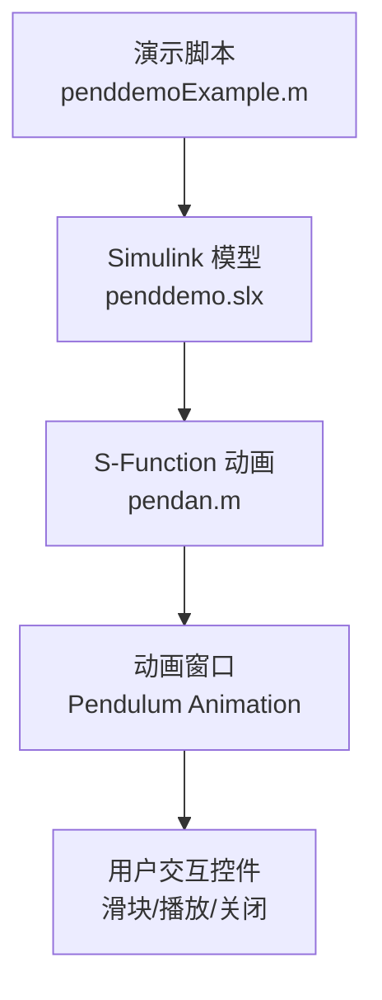
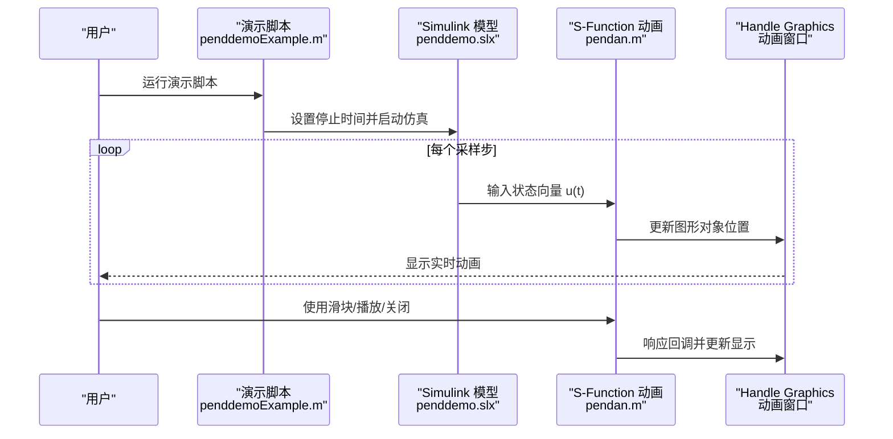
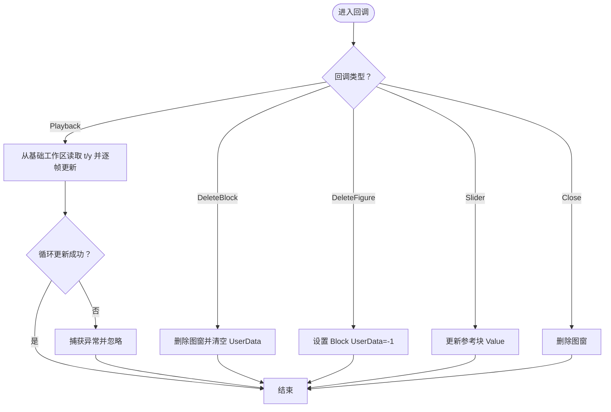
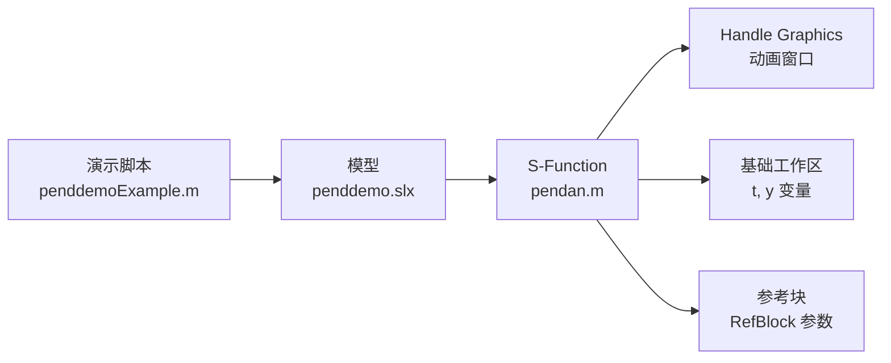

# 文件说明

<cite>
**本文引用的文件**
- [penddemoExample.m](file://penddemoExample/penddemoExample.m)
- [pendan.m](file://penddemoExample/pendan.m)
</cite>

## 目录
1. [引言](#引言)
2. [项目结构](#项目结构)
3. [核心组件](#核心组件)
4. [架构总览](#架构总览)
5. [详细组件分析](#详细组件分析)
6. [依赖关系分析](#依赖关系分析)
7. [性能考虑](#性能考虑)
8. [故障排查指南](#故障排查指南)
9. [结论](#结论)
10. [附录](#附录)

## 引言
本文件面向开发者，系统性地说明两个核心文件：主脚本 penddemoExample.m 与 S-Function 动画实现 pendan.m。前者负责打开模型、设置仿真参数并启动仿真，后者通过 Simulink 的 Level-2 MATLAB S-Function 实现倒立摆系统的实时动画可视化，包含图形对象管理、状态向量更新机制以及用户交互（滑块、播放、关闭等）的回调处理。文档将从系统架构、数据流、处理逻辑、集成点、错误处理与性能特征等方面进行深入解析，并给出扩展建议与最佳实践。

## 项目结构
该示例工程采用“演示脚本 + S-Function 动画”的双文件组织方式：
- penddemoExample.m：顶层演示脚本，负责打开 Simulink 模型、设置仿真停止时间、运行仿真，并在注释中引导用户查看动画窗口与相关子系统。
- pendan.m：Level-2 MATLAB S-Function，作为动画模块嵌入到 Simulink 中，接收来自模型的状态向量输入，驱动 Handle Graphics 图形对象更新，并提供交互控件。

图表来源
- [penddemoExample.m](file://penddemoExample/penddemoExample.m#L1-L43)
- [pendan.m](file://penddemoExample/pendan.m#L1-L397)

章节来源
- [penddemoExample.m](file://penddemoExample/penddemoExample.m#L1-L43)
- [pendan.m](file://penddemoExample/pendan.m#L1-L397)

## 核心组件
- 主脚本 penddemoExample.m
  - 打开模型并设置仿真停止时间为固定值。
  - 启动仿真，使 S-Function 动画随仿真步进更新。
  - 注释中提供关于倒立摆动力学、状态反馈控制与观测器的背景说明，并引导用户打开 Scope 等观察点。
- S-Function pendan.m
  - 作为动画模块注册输入端口、采样周期与回调方法。
  - 在 mdlUpdate 中读取当前时间与输入状态，更新动画窗口中的图形对象位置。
  - 提供多种回调处理：删除块、删除图窗、滑块回调、关闭、回放等。
  - 通过 UserData 存储图窗句柄与图形对象集合，实现跨回调的持久化访问。
  - 支持回放模式，从基础工作区读取仿真结果并逐帧重放动画。

章节来源
- [penddemoExample.m](file://penddemoExample/penddemoExample.m#L1-L43)
- [pendan.m](file://penddemoExample/pendan.m#L1-L397)

## 架构总览
下图展示了从演示脚本到模型仿真再到动画更新的整体流程：

图表来源
- [penddemoExample.m](file://penddemoExample/penddemoExample.m#L1-L43)
- [pendan.m](file://penddemoExample/pendan.m#L1-L397)

## 详细组件分析

### 组件A：演示脚本 pendemoExample.m
- 作用定位
  - 作为入口脚本，打开模型、设置仿真时长并启动仿真，同时提供关于倒立摆系统、状态反馈控制与观测器的背景说明。
- 示例代码结构
  - 使用注释块组织示例说明，包含系统背景、模型组成、控制策略与分析工具的介绍。
  - 调用 open_system 打开模型，设置 StopTime 参数，随后执行 sim 启动仿真。
- 使用说明注释
  - 注释中明确指出使用 Level-2 MATLAB S-Function 实现动画，并提供打开 pendan.m 的链接提示。
  - 对倒立摆动力学、状态反馈控制与观测器进行了简要说明，便于用户理解模型结构。
- 仿真启动逻辑
  - 通过 set_param 设置停止时间，然后调用 sim 开始仿真；仿真过程中 S-Function 将按采样周期更新动画。

章节来源
- [penddemoExample.m](file://penddemoExample/penddemoExample.m#L1-L43)

### 组件B：S-Function 动画 pendan.m
- 作为 S-Function 的职责
  - 接收来自 Simulink 的状态向量输入，驱动 Handle Graphics 图形对象更新，实现倒立摆动画的实时可视化。
  - 提供用户交互能力：滑块用于调整参考信号、播放按钮用于回放已运行的仿真、关闭按钮用于销毁图窗。
- 回调函数处理
  - DeleteBlock：当动画模块被删除时，同步删除对应的动画图窗并清理 UserData。
  - DeleteFigure：当动画图窗被删除时，将 S-Function 的 UserData 设为无效标记。
  - Slider：滑块回调根据当前滑块值更新参考块的 Value，从而影响参考标记的位置。
  - Close：关闭按钮回调直接删除图窗。
  - Playback：播放按钮回调从基础工作区读取仿真时间序列与输出，逐帧调用 LocalPendSets 更新动画。
- 图形对象管理
  - LocalPendInit 创建并初始化动画窗口、坐标轴、小车与摆杆图形对象，并将它们存入图窗的 UserData。
  - LocalPendSets 根据输入状态计算小车与摆杆的几何位置，更新图形对象的 X/YData 与文本显示。
- 状态向量更新机制
  - setup 中注册输入端口（维度为3）、采样周期为固定步长，确保每步都接收新状态并刷新动画。
  - mdlUpdate 读取当前时间与输入向量，调用 LocalPendSets 更新显示。
  - mdlTerminate 在仿真结束时恢复播放按钮可用性，避免用户误以为无法回放。
- 用户交互响应方式
  - 滑块事件通过 Slider 回调写入参考块参数，实现动态调节参考信号。
  - 播放按钮通过 Playback 回调循环播放仿真数据，内部包含异常保护以应对绘图过程中的句柄失效。
  - 关闭按钮直接删除图窗，触发 DeleteFcn 与 CloseRequestFcn 回调完成清理。

图表来源
- [pendan.m](file://penddemoExample/pendan.m#L1-L397)

章节来源
- [pendan.m](file://penddemoExample/pendan.m#L1-L397)

## 依赖关系分析
- 演示脚本对模型的依赖
  - 通过 open_system 打开 penddemo 模型，设置 StopTime 并启动仿真，使 S-Function 能够接收到输入并向动画窗口输出。
- S-Function 对外部环境的依赖
  - 依赖当前系统（gcs）与参考块名称，通过 get_param 获取父系统与参考块句柄。
  - 依赖基础工作区中的仿真结果变量（t 与 y），用于回放功能。
  - 依赖 Handle Graphics 句柄与 UserData 存储机制，实现跨回调的数据共享。
- 耦合与内聚
  - S-Function 内部高度内聚于动画绘制与交互处理；对外仅通过输入端口与回调接口耦合。
  - 与模型的耦合体现在参考块名称约定与基础工作区变量命名约定上，需保持一致性以确保功能正常。

图表来源
- [penddemoExample.m](file://penddemoExample/penddemoExample.m#L1-L43)
- [pendan.m](file://penddemoExample/pendan.m#L1-L397)

章节来源
- [penddemoExample.m](file://penddemoExample/penddemoExample.m#L1-L43)
- [pendan.m](file://penddemoExample/pendan.m#L1-L397)

## 性能考虑
- 更新频率与采样周期
  - S-Function 的采样周期固定，每步都会更新动画，这会带来一定的绘图开销。若仿真步长过小或图形对象过多，可能影响帧率。
- 绘图优化
  - 使用 surface/patch 等对象一次性设置 X/YData，减少多次 set 调用。
  - 在更新后调用 drawnow/pause 保证显示刷新，但应避免在高频更新中过度频繁调用。
- 回放模式
  - 回放时逐帧更新，内部有异常捕获以防止绘图期间句柄失效导致崩溃，但仍建议在回放前确保图窗与对象有效。
- 资源释放
  - 通过 DeleteBlock/DeleteFigure 回调及时释放图窗与 UserData，避免内存泄漏。

[本节为通用性能讨论，不直接分析具体文件]

## 故障排查指南
- 回放按钮不可用或报错
  - 现象：点击播放按钮弹出“必须先运行仿真”的提示。
  - 原因：基础工作区缺少 t 或 y 变量。
  - 处理：先运行一次仿真，确保变量存在后再尝试回放。
- 图窗关闭后无法再次打开
  - 现象：关闭动画窗口后，UserData 被设为无效，重新仿真时未重建图窗。
  - 原因：LocalPendInit 中对已存在图窗的分支仅更新对象，未重新创建。
  - 处理：可手动重启仿真或在 S-Function 中增强图窗重建逻辑。
- 滑块无效
  - 现象：拖动滑块无效果。
  - 原因：参考块名称或句柄未正确关联。
  - 处理：检查参考块名称与 S-Function 的 RefBlock 参数一致，确保 set_param 调用成功。
- 仿真结束后播放按钮仍不可用
  - 现象：仿真结束后播放按钮未恢复。
  - 原因：mdlTerminate 未找到播放按钮或句柄失效。
  - 处理：确认 Tag 一致且图窗仍存在，必要时在回调中增加健壮性判断。

章节来源
- [pendan.m](file://penddemoExample/pendan.m#L1-L397)

## 结论
penddemoExample.m 与 pendan.m 协同实现了从模型仿真到动画可视化的完整闭环：前者负责启动与配置，后者负责实时渲染与交互。二者通过约定的参考块名称与基础工作区变量名建立松耦合连接。S-Function 以 Handle Graphics 为基础，提供了稳定高效的动画更新与丰富的用户交互能力。对于扩展与维护，建议在保持现有接口不变的前提下，增强健壮性与可配置性，以便更灵活地支持不同系统与更多可视化元素。

[本节为总结性内容，不直接分析具体文件]

## 附录
- 修改建议与扩展方向
  - 新增可视化元素
    - 在 LocalPendInit 中添加新的图形对象（如轨迹线、传感器指示器），并在 LocalPendSets 中同步更新其属性。
    - 通过 UserData 扩展存储字段，避免全局变量污染。
  - 修改控制策略
    - 若需要改变参考信号来源，可在 Slider 回调中引入更复杂的映射逻辑，或将参考块替换为可编辑的 UI 控件。
  - 提升健壮性
    - 在 Playback 回放前增加对 t/y 数据格式与长度一致性的校验。
    - 在 mdlUpdate 中加入对 UserData 与句柄有效性检查，避免异常。
  - 性能优化
    - 对高频更新场景，可考虑减少 drawnow 调用次数或合并 set 操作。
    - 将静态对象（如网格、标签）分离为独立层，仅在初始化时创建，避免每步重复设置。

[本节为通用建议，不直接分析具体文件]