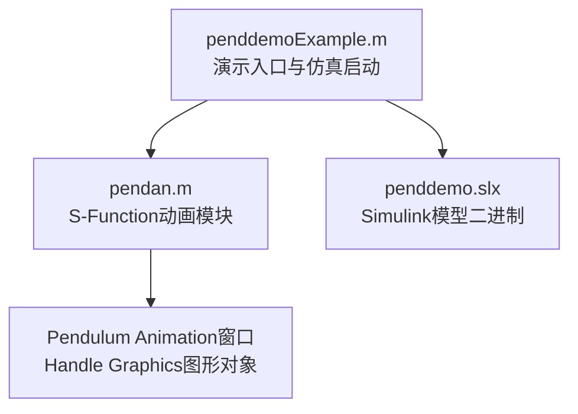
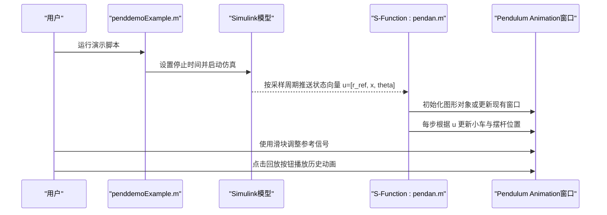
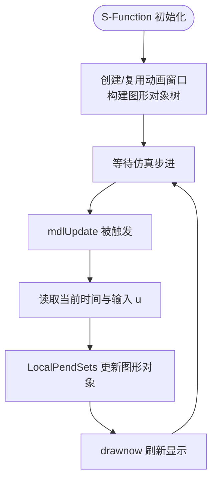
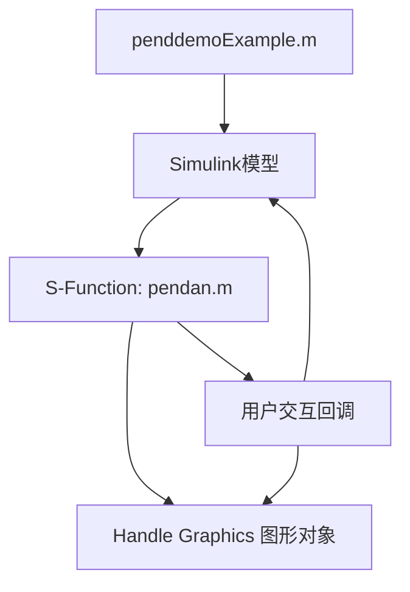

# 核心功能

<cite>
**本文引用的文件**
- [penddemoExample.m](file://penddemoExample/penddemoExample.m)
- [pendan.m](file://penddemoExample/pendan.m)
</cite>

## 目录
1. [引言](#引言)
2. [项目结构](#项目结构)
3. [核心组件](#核心组件)
4. [架构总览](#架构总览)
5. [详细组件分析](#详细组件分析)
6. [依赖关系分析](#依赖关系分析)
7. [性能考虑](#性能考虑)
8. [故障排查指南](#故障排查指南)
9. [结论](#结论)

## 引言
本文件围绕倒立摆仿真系统的四大核心功能进行深入解析：动力学建模、控制系统（含状态反馈与Luenberger观测器）、可视化与实时动画、以及信号输出与数据分析。文档以 penddemoExample.m 中的参数配置与仿真启动流程为入口，结合 pendan.m 的图形对象更新机制，阐明各模块之间的协作关系与数据传递路径，并提供可操作的使用建议与排障指引。

## 项目结构
该仓库包含两个关键脚本：
- penddemoExample.m：演示入口与说明，负责打开模型、设置仿真时长、启动仿真，并引导用户查看动力学、控制与分析模块。
- pendan.m：Level-2 MATLAB S-Function 动画模块，通过 Handle Graphics 实现倒立摆的实时动画显示与用户交互。

图表来源
- [penddemoExample.m](file://penddemoExample/penddemoExample.m#L0-L42)
- [pendan.m](file://penddemoExample/pendan.m#L0-L56)

章节来源
- [penddemoExample.m](file://penddemoExample/penddemoExample.m#L0-L42)
- [pendan.m](file://penddemoExample/pendan.m#L0-L56)

## 核心组件
- 动力学建模：通过受控子系统实现倒立摆非线性动力学，决定小车位置与摆角随时间演化。
- 控制系统：采用状态反馈控制策略，结合Luenberger观测器估计内部状态，实现对小车位置的跟踪与稳定控制。
- 可视化与实时动画：基于S-Function的Handle Graphics图形管线，按固定采样周期更新动画窗口中的小车与摆杆位置。
- 分析工具：Scope与Simulation Data Inspector用于在线信号观测与离线数据检查。

章节来源
- [penddemoExample.m](file://penddemoExample/penddemoExample.m#L27-L42)

## 架构总览
下图展示从仿真启动到动画更新的端到端流程，包括参数配置、仿真运行、数据流与图形更新的关键节点。

图表来源
- [penddemoExample.m](file://penddemoExample/penddemoExample.m#L0-L42)
- [pendan.m](file://penddemoExample/pendan.m#L58-L110)
- [pendan.m](file://penddemoExample/pendan.m#L211-L240)
- [pendan.m](file://penddemoExample/pendan.m#L161-L209)

## 详细组件分析

### 动力学建模与参数配置
- 参数入口：在 penddemoExample.m 中通过打开受控子系统，进入掩码界面，可配置质量、摆长、重力加速度等关键参数。
- 数据流向：参数经掩码传递至子系统，驱动微分方程求解，输出状态向量（小车位置与摆角）供控制器与动画模块使用。
- 使用要点：在掩码中修改参数后，重新运行仿真以使新参数生效；若需观察不同参数下的动态响应，可在仿真前调整。

章节来源
- [penddemoExample.m](file://penddemoExample/penddemoExample.m#L27-L42)

### 控制系统：状态反馈与Luenberger观测器
- 状态反馈控制：目标是跟踪参考输入 r_ref 并保持摆角稳定，避免倾倒。
- Luenberger观测器：当系统内部状态不可直接测量时，通过观测器估计状态，再进行反馈控制。
- 协作方式：控制器接收参考信号与估计状态，计算控制输入；观测器从系统输出重构内部状态；两者共同保证闭环稳定与跟踪性能。

章节来源
- [penddemoExample.m](file://penddemoExample/penddemoExample.m#L27-L42)

### 可视化与实时动画：S-Function与Handle Graphics
- S-Function注册与采样：setup 阶段注册输入端口、采样周期（每0.1秒），并将图形句柄写入 S-Function 的 UserData。
- 图形初始化：LocalPendInit 创建动画窗口、坐标轴、小车与摆杆图形对象，以及时间文本、参考标记、滑块与回放按钮等控件。
- 实时更新：mdlUpdate 在每次更新阶段读取当前时间与输入向量 u，调用 LocalPendSets 计算并设置图形对象的新坐标，随后强制刷新。
- 用户交互：
  - 滑块回调 LocalSlider 将当前值写入参考块，从而改变参考信号。
  - 回放按钮 LocalPlayback 从基础工作区读取仿真结果 t 与 y，逐帧更新动画。
  - 关闭窗口 LocalClose 删除 figure；删除 block 时 LocalDeleteBlock 清理关联 figure。
- 终止处理：mdlTerminate 在仿真结束时恢复回放按钮可用状态，便于后续回放。

图表来源
- [pendan.m](file://penddemoExample/pendan.m#L58-L110)
- [pendan.m](file://penddemoExample/pendan.m#L211-L240)
- [pendan.m](file://penddemoExample/pendan.m#L278-L321)
- [pendan.m](file://penddemoExample/pendan.m#L318-L357)

章节来源
- [pendan.m](file://penddemoExample/pendan.m#L58-L110)
- [pendan.m](file://penddemoExample/pendan.m#L211-L240)
- [pendan.m](file://penddemoExample/pendan.m#L278-L321)
- [pendan.m](file://penddemoExample/pendan.m#L318-L357)

### 信号输出与数据分析：Scope与Simulation Data Inspector
- Scope：在仿真过程中实时显示关键信号，便于在线观测系统行为。
- Simulation Data Inspector：仿真结束后可加载历史数据，进行多信号对比、标注与导出，辅助分析与报告生成。
- 使用建议：在仿真前确保相关信号已启用记录；仿真完成后打开 Inspector 进行深入分析。

章节来源
- [penddemoExample.m](file://penddemoExample/penddemoExample.m#L27-L42)

## 依赖关系分析
- penddemoExample.m 作为高层入口，负责打开模型、设置仿真参数并启动仿真。
- pendan.m 作为底层动画模块，依赖于来自 Simulink 的状态向量输入，并通过 Handle Graphics 实时绘制。
- 动画窗口与 S-Function 之间通过 UserData 共享图形句柄，实现跨模块的数据与生命周期管理。
- 用户交互事件（滑块、回放、关闭）由 S-Function 内部回调函数处理，回调函数通过 set_param 或 evalin 与 Simulink/基础工作区通信。

图表来源
- [penddemoExample.m](file://penddemoExample/penddemoExample.m#L0-L42)
- [pendan.m](file://penddemoExample/pendan.m#L0-L56)
- [pendan.m](file://penddemoExample/pendan.m#L161-L209)

章节来源
- [penddemoExample.m](file://penddemoExample/penddemoExample.m#L0-L42)
- [pendan.m](file://penddemoExample/pendan.m#L0-L56)
- [pendan.m](file://penddemoExample/pendan.m#L161-L209)

## 性能考虑
- 采样周期：S-Function 以固定周期更新动画，周期过短会增加图形刷新开销，过长则影响视觉流畅度。默认0.1秒平衡了实时性与性能。
- 图形刷新：使用 drawnow 强制刷新，建议避免在高频循环中频繁创建/销毁对象；动画窗口关闭时及时清理资源。
- 回放性能：回放模式遍历历史数据逐帧绘制，数据量大时可能卡顿；可考虑降低回放速度或减少刷新频率。
- 交互响应：滑块与回放按钮的回调应尽量轻量，避免阻塞主线程。

## 故障排查指南
- 无法回放动画：回放按钮在仿真运行期间会被禁用；请先完成仿真，再点击回放。若仍失败，确认基础工作区存在 t 与 y 变量。
- 动画窗口不显示：检查 S-Function 是否成功初始化图形对象；确认 UserData 中保存的 figure 句柄有效。
- 滑块无效：确认 Reference Block 名称与路径正确，回调函数能通过 set_param 修改其 Value。
- 仿真结束后回放按钮不可用：mdlTerminate 应在仿真终止时恢复按钮可用；如异常，手动重启模型或重新初始化 S-Function。

章节来源
- [pendan.m](file://penddemoExample/pendan.m#L161-L209)
- [pendan.m](file://penddemoExample/pendan.m#L112-L159)
- [pendan.m](file://penddemoExample/pendan.m#L242-L279)
- [pendan.m](file://penddemoExample/pendan.m#L354-L395)

## 结论
该系统以 penddemoExample.m 为入口，结合 pendan.m 的S-Function动画模块，实现了倒立摆的完整仿真链路：从参数配置与动力学建模，到状态反馈与观测器控制，再到实时可视化与交互，最后到信号输出与数据分析。四者协同工作，既满足教学演示需求，也为进一步扩展控制策略与分析工具提供了清晰的接口与数据通道。