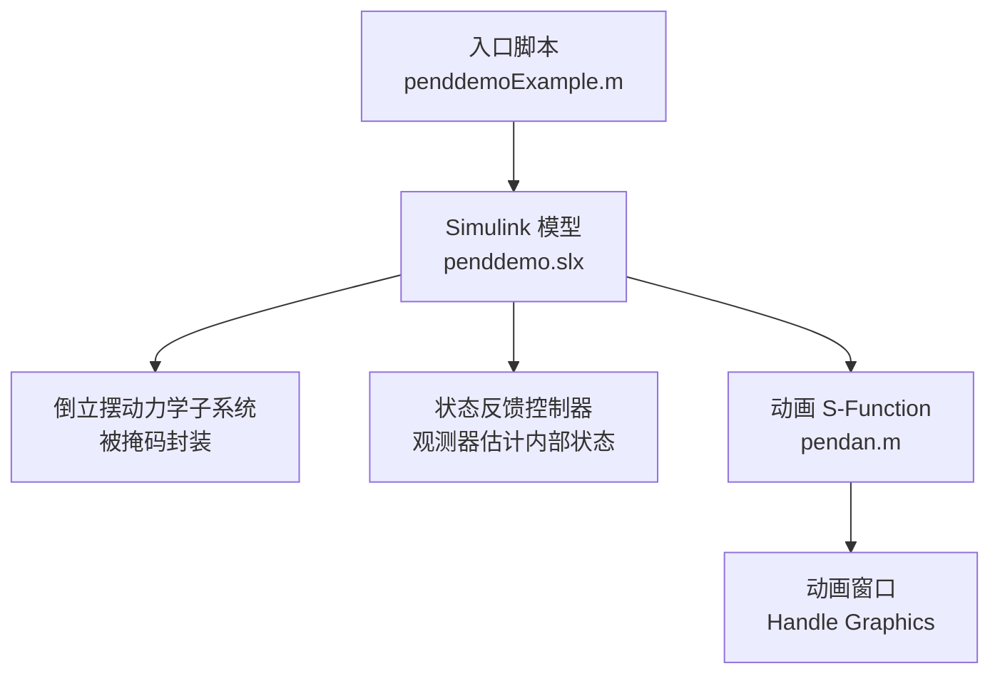
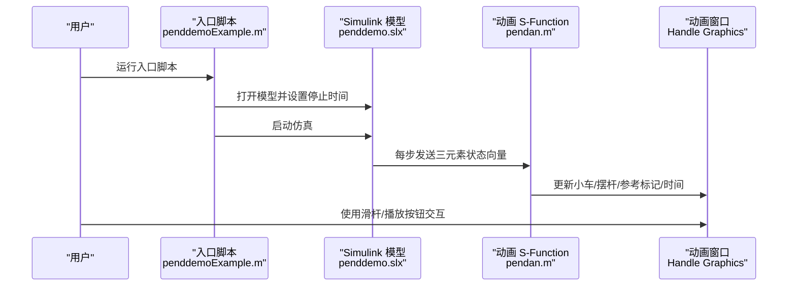
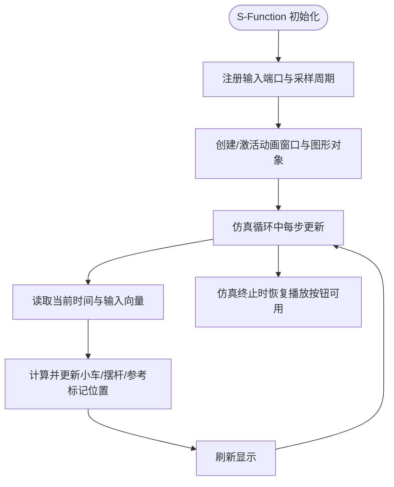
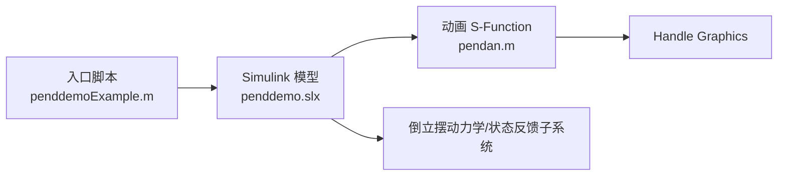

# 项目概述

<cite>
**本文引用的文件**
- [penddemoExample.m](file://penddemoExample/penddemoExample.m)
- [pendan.m](file://penddemoExample/pendan.m)
- [penddemo.slx](file://penddemoExample/penddemo.slx)
- [pendulum1.png](file://penddemoExample/pendulum1.png)
</cite>

## 目录
1. [引言](#引言)
2. [项目结构](#项目结构)
3. [核心组件](#核心组件)
4. [架构总览](#架构总览)
5. [详细组件分析](#详细组件分析)
6. [依赖关系分析](#依赖关系分析)
7. [性能考量](#性能考量)
8. [故障排查指南](#故障排查指南)
9. [结论](#结论)
10. [附录](#附录)

## 引言
本项目是一个基于 MATLAB/Simulink 的倒立摆系统仿真与动画演示工具，面向控制系统教学与实验场景。它通过一个移动小车与倒立摆组成的二自由度非线性系统，演示状态反馈控制与观测器估计在稳定平衡点附近的控制策略。项目以交互式动画窗口直观展示系统的动态响应，帮助初学者理解倒立摆的物理特性与控制原理，同时为高级用户提供可扩展的建模与仿真实验平台。

## 项目结构
项目采用“脚本入口 + S-Function 动画模块”的组织方式：
- 入口脚本负责打开 Simulink 模型、设置仿真参数并启动仿真，同时引导用户查看动画窗口与系统子模块。
- S-Function 动画模块通过 MATLAB Handle Graphics 实现每步更新的实时绘图，支持播放回放、滑杆调节参考信号等交互功能。
- Simulink 模型包含倒立摆动力学子系统、状态反馈控制器与观测器等关键模块（由入口脚本打开并说明）。

图表来源
- [penddemoExample.m](file://penddemoExample/penddemoExample.m#L0-L42)
- [pendan.m](file://penddemoExample/pendan.m#L0-L110)
- [penddemo.slx](file://penddemoExample/penddemo.slx)

章节来源
- [penddemoExample.m](file://penddemoExample/penddemoExample.m#L0-L42)
- [pendan.m](file://penddemoExample/pendan.m#L0-L110)

## 核心组件
- 入口脚本：负责打开模型、设置停止时间、运行仿真，并提示用户查看 Scope 与动画窗口。
- 动画 S-Function：接收来自 Simulink 的三元素向量输入（参考值、小车位置、摆角），按固定采样周期更新动画图形对象。
- 动画窗口：包含小车、摆杆、参考标记、时间显示、滑杆与播放按钮等控件，支持回放与关闭。
- 系统子模块：倒立摆动力学子系统与状态反馈控制器（由入口脚本打开说明）。

章节来源
- [penddemoExample.m](file://penddemoExample/penddemoExample.m#L0-L42)
- [pendan.m](file://penddemoExample/pendan.m#L0-L110)

## 架构总览
下图展示了从入口脚本到 Simulink 模型、再到动画 S-Function 的调用链路与数据流。

图表来源
- [penddemoExample.m](file://penddemoExample/penddemoExample.m#L0-L42)
- [pendan.m](file://penddemoExample/pendan.m#L58-L110)

## 详细组件分析

### 组件一：入口脚本（penddemoExample.m）
- 职责
  - 打开 Simulink 模型并设置仿真停止时间。
  - 启动仿真后，引导用户查看 Scope 与动画窗口。
  - 提示用户打开“倒立摆动力学子系统”与“状态反馈控制”子模块进行参数配置与观察。
- 关键行为
  - 打开模型与子系统窗口。
  - 设置仿真时长并执行仿真。
  - 说明系统采用观测器的状态反馈控制策略。

章节来源
- [penddemoExample.m](file://penddemoExample/penddemoExample.m#L0-L42)

### 组件二：动画 S-Function（pendan.m）
- 设计要点
  - 注册输入端口（维度为 3，直接馈通）、采样周期（每 0.1 秒更新一次）。
  - 在首次初始化时创建动画窗口与图形对象（小车、摆杆、参考标记、时间文本、滑杆、播放按钮）。
  - 每步更新根据输入向量调整图形对象位置，并刷新显示。
  - 支持删除块、删除图窗、滑杆回调、关闭窗口、回放播放等功能。
- 数据接口
  - 输入：三元素向量，分别对应参考值、小车位置、摆角。
  - 输出：无（仅内部绘图）。
- 交互能力
  - 滑杆用于改变参考信号值。
  - 回放按钮在仿真结束后播放历史动画。
  - 关闭按钮销毁图窗。

图表来源
- [pendan.m](file://penddemoExample/pendan.m#L0-L110)
- [pendan.m](file://penddemoExample/pendan.m#L110-L200)
- [pendan.m](file://penddemoExample/pendan.m#L200-L321)

章节来源
- [pendan.m](file://penddemoExample/pendan.m#L0-L110)
- [pendan.m](file://penddemoExample/pendan.m#L110-L200)
- [pendan.m](file://penddemoExample/pendan.m#L200-L321)

### 组件三：系统子模块（倒立摆动力学与状态反馈）
- 倒立摆动力学子系统
  - 采用掩码子系统封装，便于设置质量、摆长、重力加速度等参数。
  - 输出小车位置与摆角的导数，驱动控制系统与动画。
- 状态反馈控制
  - 采用观测器估计系统内部状态（如速度、角速度），实现对小车位置的跟踪控制。
  - 控制目标是在摆角偏离平衡点时，通过移动小车位置抵消重力影响，维持稳定平衡。

章节来源
- [penddemoExample.m](file://penddemoExample/penddemoExample.m#L27-L42)

## 依赖关系分析
- 入口脚本依赖于 Simulink 模型文件与动画 S-Function。
- 动画 S-Function 依赖于 MATLAB Handle Graphics 与 Simulink 的连续更新机制。
- 系统子模块依赖于 Simulink 的数值积分器与控制系统模块库。

图表来源
- [penddemoExample.m](file://penddemoExample/penddemoExample.m#L0-L42)
- [pendan.m](file://penddemoExample/pendan.m#L0-L110)

章节来源
- [penddemoExample.m](file://penddemoExample/penddemoExample.m#L0-L42)
- [pendan.m](file://penddemoExample/pendan.m#L0-L110)

## 性能考量
- 动画采样周期：每 0.1 秒更新一次，兼顾实时性与计算开销。
- 图形刷新：每次更新后调用刷新函数，确保画面流畅。
- 回放机制：回放时逐帧绘制，若图窗被删除会捕获异常避免中断。
- 建议
  - 在复杂场景下可适当增大采样周期以降低 CPU 占用。
  - 避免在动画窗口上叠加过多额外图形对象，以免影响刷新性能。

章节来源
- [pendan.m](file://penddemoExample/pendan.m#L58-L110)
- [pendan.m](file://penddemoExample/pendan.m#L110-L200)

## 故障排查指南
- 无法打开动画窗口
  - 检查是否已运行仿真，回放按钮仅在仿真结束后可用。
  - 若窗口被意外关闭，请重新运行入口脚本以重建动画窗口。
- 回放失败
  - 确认已先运行仿真，回放需要依赖仿真产生的时间序列与状态数据。
  - 若出现异常，尝试重新启动仿真并再次点击回放。
- 滑杆无效
  - 确认动画窗口处于可见状态且未被最小化。
  - 若参考信号未变化，检查掩码子系统中的参考值设置。
- Scope 无输出
  - 确认已打开 Scope 子系统窗口并正确连接信号。
  - 检查模型是否成功运行至结束时间。

章节来源
- [penddemoExample.m](file://penddemoExample/penddemoExample.m#L0-L42)
- [pendan.m](file://penddemoExample/pendan.m#L110-L200)

## 结论
本项目以简洁清晰的方式展示了倒立摆系统的建模、控制与可视化流程，适合控制理论教学与实验入门。通过掩码子系统与观测器状态反馈控制，学生可以直观理解非线性系统的稳定性问题与控制策略；通过动画 S-Function 与交互控件，能够加深对系统动态响应的理解。对于进阶用户，可在现有框架基础上扩展控制器设计、加入噪声与扰动、引入更复杂的观测器或鲁棒控制方法，进一步验证不同控制策略在实际工程中的适用性。

## 附录
- 基本使用流程（结合示例脚本）
  1) 运行入口脚本以打开模型并启动仿真。
  2) 查看 Scope 与动画窗口，观察系统响应。
  3) 打开“倒立摆动力学子系统”与“状态反馈控制”子模块，调整参数并观察效果。
  4) 使用动画窗口的滑杆改变参考信号，回放按钮查看历史轨迹。
- 教学价值
  - 概念性：倒立摆作为经典非线性系统，是理解状态反馈、观测器与稳定性的重要载体。
  - 实践性：提供可运行的仿真模型与可视化界面，便于学生动手实践与参数调优。
  - 应用性：可用于验证不同控制策略（如 LQR、滑模、自适应控制等）在倒立摆系统中的性能与鲁棒性。

章节来源
- [penddemoExample.m](file://penddemoExample/penddemoExample.m#L0-L42)
- [pendan.m](file://penddemoExample/pendan.m#L0-L110)